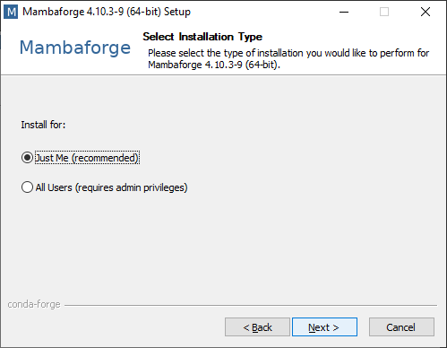
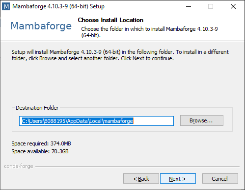
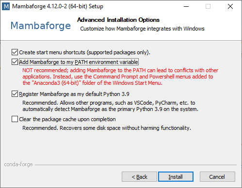
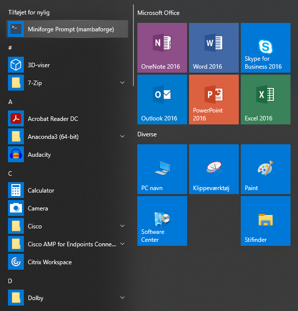

.. _setup:

Anbefalet opsætning
====================

Python kan installeres på mange forskellige måder. Erfaringsmæssigt har det vist
sig at være fordelagtigt at undgå den officielle distribution fra `The Python
Software Foundation`_ og i stedet bruge en tredjeparts distribution som fx
`Anaconda`_. Anaconda er et bredt anvendt rammeværk der gør det muligt at
arbejde med mange forskellige isolerede udviklingsmiljøer. Grundet forskellige
licensforhold er Anaconda ikke egnet til brug i SDFE, hvorfor vi i stedet
anbefaler at bruge `Mamba`_, der er et frit og åbent alternativ til Anaconda.
MambaForge er som udgangspunkt sat op til kun at hente pakker fra kanalen
``conda-forge``, som er en organisation af stabile og opdaterede versioner af en
lang række pakker til en bred modtagergruppe. (Læs mere her: `Why conda-forge?`_.)

.. Pakkestyringsværktøjet `mamba` er hurtigere til at opløse afhængigheder end `conda`, der følger med Anaconda-distributionen.

Herunder beskrives installationen af Mamba og de vigtigste funktioner i Mamba
demonstreres.

.. note::

    Denne vejledning er til Windows. Linux-brugere henvises til
    `Mambas officielle dokumentation`_.

Installationen af Mamba er i store træk ukompliceret og installeres som de
fleste andre programmer på Windows. For de fleste vil noter beskrevet i
afsnittet :ref:`hurtigruten` være tilstrækkeligt, men en mere grundig vejledning
er også at finde herunder i afsnittet :ref:`fuld_vejledning`.

.. _hurtigruten:

Hurtigruten
------------

* Download `Mamba installationsprogrammet`_
* Kør installationsprogrammet og klik dig gennem de enkelte skridt, vælg undervejs at
    * Installere "just for me"
    * Placere filerne under ``C:\Users\<brugernavn>\AppData\Local\mambaforge``
    * "Register Mambaforge as my default Python"
    * "Clear the package cache upon completion"

.. _fuld_vejledning:

Den fulde vejledning
----------------------

Start med at Downloade `Mamba installationsprogrammet`_ og kør
installationsprogrammet.

.. figure:: ./images/mamba-install-01.png
    :align: center
    :alt:   Mamba installation

    *Start på Mambas installation*

Godkend licensbetingelserne. Mamba er frigivet under BSD-3 licensen,
hvilket er uproblematisk for os som brugere.

.. figure:: ./images/mamba-install-02.png
    :align: center
    :alt: licensforhold

    *Licensforhold*

Vælg installationstype. Ved at vælge "Just for me" her, installerer
vi programmet under den aktuelle bruger og undgår derved at skulle
taste en administratoradgangskode

    *Installationstype*

Vælg installationsplacering. Installationsprogrammet vælger automatisk en
standardiseret placering som bør følges. Tryk næste.

    *Installationsplacering*

Sidste skridt i installationen er at tage stilling til avancerede
indstillinger. Vi følger de anbefalede valgmuligheder:

* Registrér Mambaforge som default Python installation
* Ryd cache efter installation

Førstnævnte er det bedste valg for de fleste. Hvis det **ikke** er det bedste
valg for dig ved du det godt og kan med fordel vælge anderledes. Alle andre bør
følge anbefalingen her.

    *Avancerede installationsvalg*

Afvent at installationsprogrammet kører færdig.

Demonstration
--------------

Brug af Python via Mambaforge sker som udgangspunkt i den medfølgende
terminal, der går under navnet "Miniforge Prompt (mambaforge)". Find den
i Windows' startmenu.

    *Miniforge prompt i startmenuen*

Når prompten åbnes mødes du af et terminalvindue med følgende indhold:

.. code-block:: none

    (base) C:\>

hvilket indikerer at du arbejder i Mambas standardmiljø ``base``. Det anbefales
aldrig at bruge dette og i stedet oprette dedikerede miljøer til hvert enkelt
projekt der arbejdes på. Denne webside er eksempelvis skabt i et miljø der
hedder ``sdfepython``, der er oprettet med kommandoen ``mamba create``:

.. code-block:: none

    (base) C:\>mamba create -n sdfepython python sphinx

                    __    __    __    __
                    /  \  /  \  /  \  /  \
                    /    \/    \/    \/    \
    ███████████████/  /██/  /██/  /██/  /████████████████████████
                /  / \   / \   / \   / \  \____
                /  /   \_/   \_/   \_/   \    o \__,
                / _/                       \_____/  `
                |/
            ███╗   ███╗ █████╗ ███╗   ███╗██████╗  █████╗
            ████╗ ████║██╔══██╗████╗ ████║██╔══██╗██╔══██╗
            ██╔████╔██║███████║██╔████╔██║██████╔╝███████║
            ██║╚██╔╝██║██╔══██║██║╚██╔╝██║██╔══██╗██╔══██║
            ██║ ╚═╝ ██║██║  ██║██║ ╚═╝ ██║██████╔╝██║  ██║
            ╚═╝     ╚═╝╚═╝  ╚═╝╚═╝     ╚═╝╚═════╝ ╚═╝  ╚═╝

            mamba (0.19.0) supported by @QuantStack

            GitHub:  https://github.com/mamba-org/mamba
            Twitter: https://twitter.com/QuantStack

    █████████████████████████████████████████████████████████████

    Looking for: ['python', 'sphinx']

    conda-forge/win-64       Using cache
    conda-forge/noarch       Using cache
    pkgs/msys2/win-64        [====================] (00m:00s) No change
    pkgs/main/noarch         [====================] (00m:00s) No change
    pkgs/r/win-64            [====================] (00m:00s) No change
    pkgs/main/win-64         [====================] (00m:00s) No change
    pkgs/r/noarch            [====================] (00m:00s) No change
    pkgs/msys2/noarch        [====================] (00m:00s) No change
    Transaction

    Prefix: C:\Users\b012349\AppData\Local\mambaforge\envs\sdfepython

    Updating specs:

    - python
    - sphinx

    Package                               Version  Build               Channel                  Size
    ----------------------------------------------------------------------------------------------------
    Install:
    ----------------------------------------------------------------------------------------------------

    + alabaster                            0.7.12  py_0                conda-forge/noarch     Cached
    + babel                                 2.9.1  pyh44b312d_0        conda-forge/noarch     Cached
    + brotlipy                              0.7.0  py310he2412df_1003  conda-forge/win-64     Cached
    + bzip2                                 1.0.8  h8ffe710_4          conda-forge/win-64     Cached
    + ca-certificates                   2021.10.8  h5b45459_0          conda-forge/win-64     Cached
    + certifi                           2021.10.8  py310h5588dad_1     conda-forge/win-64     Cached
    + cffi                                 1.15.0  py310hcbf9ad4_0     conda-forge/win-64     Cached
    + charset-normalizer                   2.0.11  pyhd8ed1ab_0        conda-forge/noarch      35 KB
    + colorama                              0.4.4  pyh9f0ad1d_0        conda-forge/noarch     Cached
    + cryptography                         36.0.0  py310h21b164f_0     pkgs/main/win-64       Cached
    + docutils                             0.17.1  py310h5588dad_1     conda-forge/win-64     Cached
    + idna                                    3.3  pyhd8ed1ab_0        conda-forge/noarch     Cached
    + imagesize                             1.3.0  pyhd8ed1ab_0        conda-forge/noarch     Cached
    + importlib-metadata                   4.10.1  py310h5588dad_0     conda-forge/win-64     Cached
    + jinja2                                3.0.3  pyhd8ed1ab_0        conda-forge/noarch     Cached
    + libffi                                3.4.2  h8ffe710_5          conda-forge/win-64     Cached
    + libzlib                              1.2.11  h8ffe710_1013       conda-forge/win-64     Cached
    + markupsafe                            2.0.1  py310he2412df_1     conda-forge/win-64     Cached
    + openssl                               3.0.0  h8ffe710_2          conda-forge/win-64     Cached
    + packaging                              21.3  pyhd8ed1ab_0        conda-forge/noarch     Cached
    + pip                                  22.0.3  pyhd8ed1ab_0        conda-forge/noarch       1 MB
    + pycparser                              2.21  pyhd8ed1ab_0        conda-forge/noarch     Cached
    + pygments                             2.11.2  pyhd8ed1ab_0        conda-forge/noarch     Cached
    + pyopenssl                            22.0.0  pyhd8ed1ab_0        conda-forge/noarch      49 KB
    + pyparsing                             3.0.7  pyhd8ed1ab_0        conda-forge/noarch     Cached
    + pysocks                               1.7.1  py310h5588dad_4     conda-forge/win-64     Cached
    + python                               3.10.2  hcf16a7b_3_cpython  conda-forge/win-64      16 MB
    + python_abi                             3.10  2_cp310             conda-forge/win-64     Cached
    + pytz                                 2021.3  pyhd8ed1ab_0        conda-forge/noarch     Cached
    + requests                             2.27.1  pyhd8ed1ab_0        conda-forge/noarch     Cached
    + setuptools                           60.8.1  py310h5588dad_0     conda-forge/win-64       1 MB
    + snowballstemmer                       2.2.0  pyhd8ed1ab_0        conda-forge/noarch     Cached
    + sphinx                                4.4.0  pyh6c4a22f_1        conda-forge/noarch     Cached
    + sphinxcontrib-applehelp               1.0.2  py_0                conda-forge/noarch     Cached
    + sphinxcontrib-devhelp                 1.0.2  py_0                conda-forge/noarch     Cached
    + sphinxcontrib-htmlhelp                2.0.0  pyhd8ed1ab_0        conda-forge/noarch     Cached
    + sphinxcontrib-jsmath                  1.0.1  py_0                conda-forge/noarch     Cached
    + sphinxcontrib-qthelp                  1.0.3  py_0                conda-forge/noarch     Cached
    + sphinxcontrib-serializinghtml         1.1.5  pyhd8ed1ab_1        conda-forge/noarch     Cached
    + sqlite                               3.37.0  h8ffe710_0          conda-forge/win-64     Cached
    + tk                                   8.6.11  h8ffe710_1          conda-forge/win-64     Cached
    + tzdata                                2021e  he74cb21_0          conda-forge/noarch     Cached
    + ucrt                           10.0.20348.0  h57928b3_0          conda-forge/win-64     Cached
    + urllib3                              1.26.8  pyhd8ed1ab_1        conda-forge/noarch     Cached
    + vc                                     14.2  hb210afc_6          conda-forge/win-64     Cached
    + vs2015_runtime                  14.29.30037  h902a5da_6          conda-forge/win-64     Cached
    + wheel                                0.37.1  pyhd8ed1ab_0        conda-forge/noarch     Cached
    + win_inet_pton                         1.1.0  py310h5588dad_3     conda-forge/win-64     Cached
    + xz                                    5.2.5  h62dcd97_1          conda-forge/win-64     Cached
    + zipp                                  3.7.0  pyhd8ed1ab_1        conda-forge/noarch      12 KB

    Summary:

    Install: 50 packages

    Total download: 19 MB

    ----------------------------------------------------------------------------------------------------

    Confirm changes: [Y/n]

Tryk ``Y`` for at bekræfte oprettelse af det nye miljø

.. code-block:: none

    Finished zipp                                 (00m:00s)              12 KB     60 KB/s
    Finished pyopenssl                            (00m:00s)              49 KB    169 KB/s
    Finished charset-normalizer                   (00m:00s)              35 KB     38 KB/s
    Finished pip                                  (00m:00s)               1 MB      2 MB/s
    Finished setuptools                           (00m:02s)               1 MB    386 KB/s
    Finished python                               (00m:10s)              16 MB      1 MB/s
    Downloading  [=====================================================================] (00m:34s)    1.75 MB/s
    Extracting   [=====================================================================] (00m:33s)        6 / 6
    Preparing transaction: done
    Verifying transaction: done
    Executing transaction: done
    #
    # To activate this environment, use
    #
    #     $ conda activate sdfepython
    #
    # To deactivate an active environment, use
    #
    #     $ conda deactivate

    (base) C:\>

.. note::

    Med Mamba kan du bruge ``conda`` kommandoen ligesom i Anaconda, da den
    fungerer som et alias for kommandoen ``mamba``. De to applikationer er tæt
    relaterede og der vil ofte bliver foreslået brug af ``conda`` i de tekster
    programmet selv skriver i terminalen.

Herefter kan vi aktivere det nye miljø

.. code-block:: none

    (base) C:\>mamba activate sdfepython

    (sdfepython) C:\>

Bemærk at der nu står ``sdfepython`` i parantesen før stien.

.. _`The Python Software Foundation`: https://www.python.org/psf/
.. _`Anaconda`: https://www.anaconda.com/
.. _`Mamba`: https://mamba.readthedocs.io/en/latest/
.. _`Mambas officielle dokumentation`: https://mamba.readthedocs.io/en/latest/installation.html
.. _`Why conda-forge?`: https://conda-forge.org/docs/user/introduction.html#why-conda-forge
.. _`Mamba installationsprogrammet`: https://github.com/conda-forge/miniforge/releases/latest/download/Mambaforge-Windows-x86_64.exe
